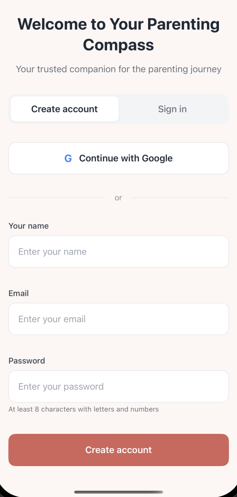
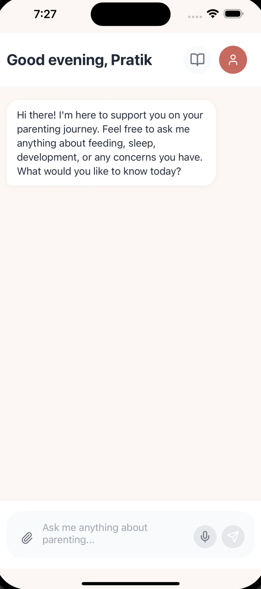
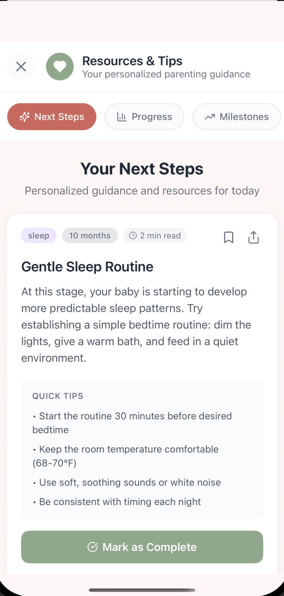
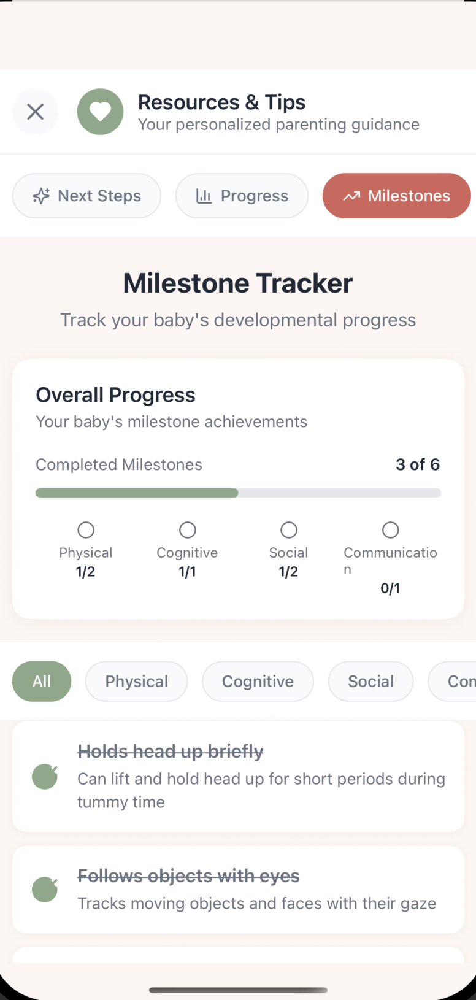
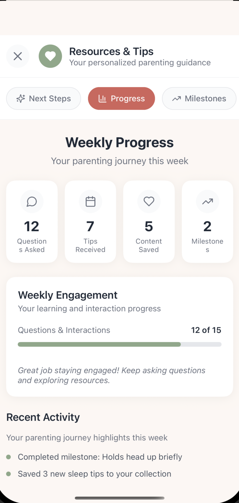
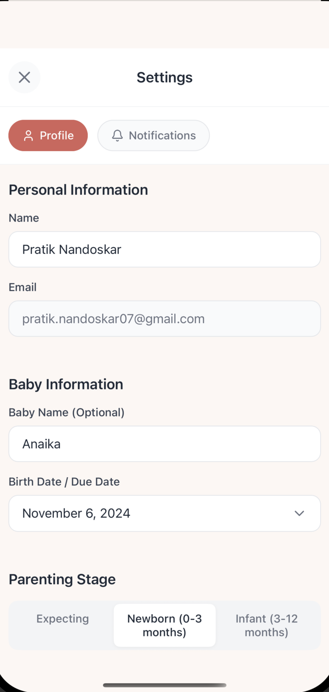

# Parenting App

**Your trusted companion for the parenting journey**

A comprehensive AI-powered parenting app that provides personalized guidance, milestone tracking, and expert advice tailored to your family's unique needs. Whether you're expecting or already have children, this app supports you every step of the way with evidence-based resources and intelligent recommendations.

## 🌟 What This App Does

**Parenting App** is designed to make parenting less overwhelming and more informed. It combines personalized AI guidance with practical tools to help parents:

### 🤖 **AI-Powered Chat Support**
Get instant, personalized answers to your parenting questions. Our AI assistant understands your specific situation (baby's age, parenting stage, concerns) and provides tailored advice on:
- Sleep routines and sleep training
- Feeding schedules and nutrition
- Developmental milestones
- Behavioral guidance
- Health and safety concerns

### 📈 **Milestone Tracking & Progress**
Track your child's developmental journey with our comprehensive milestone system:
- **Physical Development**: Motor skills, coordination, physical growth
- **Cognitive Development**: Learning, problem-solving, memory
- **Social Development**: Interaction skills, emotional awareness
- **Communication**: Language development, verbal and non-verbal skills

Visual progress tracking shows completed milestones (3 of 6 in the example) with detailed breakdowns by category.

### 📚 **Personalized Resources & Daily Tips**
- **Daily Tips**: Customized guidance based on your child's age and development stage
- **Smart Recommendations**: Articles and resources matched to your current needs
- **Next Steps**: Actionable guidance for today with "Mark as Complete" functionality
- **Progress Tracking**: Weekly stats on questions asked, tips received, content saved, and milestones achieved

### ⚙️ **Smart Personalization**
The app learns from your profile to deliver relevant content:
- **Parent Information**: Name, email, preferences
- **Child Profiles**: Names, birth dates, developmental stages
- **Parenting Stage Selection**: Expecting, Newborn (0-3 months), Infant (3-12 months), Toddler (1-3 years)
- **Automatic Recommendations**: Content adapts as your child grows

### 🎯 **Key Features Shown in Screenshots**
1. **Welcome & Onboarding**: Clean account creation with Google OAuth integration
2. **AI Chat Interface**: Natural conversation with "Good evening, Pratik" personalized greetings
3. **Resources Hub**: Three-tab system (Next Steps, Progress, Milestones) for organized content discovery
4. **Milestone Tracker**: Visual progress with category breakdowns and completion tracking
5. **Weekly Progress**: Engagement metrics and activity highlights
6. **Personalized Tips**: Age-appropriate content with quick tips and completion tracking
7. **Settings Profile**: Easy profile management for both parent and child information

## 🚀 Tech Stack

- **Frontend**: React Native 0.79, React 19, Expo 53 (Expo Router)
- **Language**: TypeScript
- **State Management**: Zustand
- **Backend**: Supabase (Database, Auth, Real-time)
- **Testing**: Jest + React Native Testing Library, Vitest
- **UI/UX**: Custom components with modern, accessible design

## 📱 Platform Support

- **iOS**: Native iOS app with iPhone and iPad support
- **Android**: Native Android app
- **Web**: Progressive Web App (PWA) via Expo

## 🏗️ Getting Started

### Prerequisites
- Node.js 18+ and npm
- Xcode (iOS development) with CocoaPods
- Android Studio (Android development)
- Expo CLI (`npm i -g expo-cli`) - optional but recommended
- EAS CLI (`npm i -g eas-cli`) - for cloud builds

### Installation

```bash
# 1. Clone the repository
git clone https://github.com/Pratikn07/parenting-app.git
cd parenting-app

# 2. Install dependencies
npm install

# 3. Configure environment variables
# Create .env file with:
# EXPO_PUBLIC_SUPABASE_URL=your-supabase-project-url
# EXPO_PUBLIC_SUPABASE_ANON_KEY=your-supabase-anon-key
# EXPO_PUBLIC_API_URL=https://your-backend-api.com/v1

# 4. Start the development server
npm run dev

# 5. Run on your preferred platform
npm run ios     # iOS Simulator
npm run android # Android Emulator
```

### Environment Setup
The app requires these environment variables:
- `EXPO_PUBLIC_SUPABASE_URL`: Your Supabase project URL
- `EXPO_PUBLIC_SUPABASE_ANON_KEY`: Your Supabase anonymous key  
- `EXPO_PUBLIC_API_URL`: Backend API base URL (for additional services)

See `src/lib/supabase.ts` and `src/lib/constants.ts` for configuration details.

## 📁 Project Structure

```
app/                      # Expo Router screens and navigation
├── auth.tsx             # Authentication screen
├── chat.tsx             # AI chat interface
├── onboarding.tsx       # User onboarding flow
├── resources.tsx        # Resources & tips hub
├── settings.tsx         # User profile and settings
└── (tabs)/              # Tab navigation layout

src/
├── frontend/            # Reusable UI components and screens
├── lib/                 # Supabase client, database types, constants
├── services/            # Business logic (auth, recommendations)
├── shared/              # Stores, types, utilities
└── __tests__/           # Test files and setup

ios/                     # Native iOS project
assets/                  # Images, icons, screenshots
```

## 🧪 Available Scripts

```bash
# Development
npm run dev              # Start Expo development server
npm run ios              # Run on iOS simulator
npm run android          # Run on Android emulator

# Testing
npm run test             # Run Jest tests
npm run test:unit        # Run Vitest unit tests
npm run test:coverage    # Generate test coverage report
npm run test:all         # Run all tests (Jest + Vitest)

# Building
npm run build:web        # Build for web deployment
```

## 🏗️ Building for Production

### Using EAS (Recommended)

```bash
# Login to EAS
eas login

# Configure build profiles
eas build:configure

# Build for iOS
eas build -p ios --profile production

# Build for Android  
eas build -p android --profile production

# Build for development/testing
eas build -p ios --profile development
eas build -p android --profile development
```

Build profiles are configured in `eas.json`.

## 📸 App Screenshots

### Authentication & Onboarding

*Clean, welcoming interface with Google OAuth integration and manual account creation options*

### AI Chat Assistant
  
*Personalized AI assistant providing expert parenting guidance with natural conversation flow*

### Resources & Next Steps

*Daily personalized tips with actionable content, quick tips, and completion tracking*

### Milestone Tracking

*Comprehensive developmental milestone tracking across Physical, Cognitive, Social, and Communication categories*

### Progress Analytics

*Detailed weekly engagement metrics showing questions asked, tips received, content saved, and milestones achieved*

### User Profile & Settings

*Easy profile management for both parent and child information with parenting stage selection*

## 🗃️ Database & Backend

- **Database**: Supabase PostgreSQL with real-time subscriptions
- **Authentication**: Supabase Auth with Google OAuth integration
- **File Storage**: Supabase Storage for user uploads
- **Schema**: See `supabase-schema.sql` for complete database structure

Key tables:
- `users`: Parent profiles and preferences
- `children`: Child profiles and birth information  
- `daily_tips`: Personalized daily guidance
- `articles`: Curated parenting resources
- `user_activity_log`: Engagement tracking
- `milestones`: Developmental milestone definitions

## 🧪 Testing

```bash
# Run all tests
npm run test:all

# Jest (React Native components)
npm run test
npm run test:coverage

# Vitest (Business logic)
npm run test:unit
npm run test:unit:watch
npm run test:unit:ui
```

Test coverage reports are generated in the `coverage/` directory.

## 🔒 Security & Privacy

- All sensitive data is encrypted and stored securely in Supabase
- Google OAuth integration for secure authentication
- No personal data is logged or shared with third parties
- Child information is protected with strict access controls

## 🚀 Deployment

### Environment Variables for Production

```bash
# Add secrets to EAS for cloud builds
eas secret:create --name EXPO_PUBLIC_SUPABASE_URL --value "https://your-project.supabase.co"
eas secret:create --name EXPO_PUBLIC_SUPABASE_ANON_KEY --value "your-anon-key"
eas secret:create --name EXPO_PUBLIC_API_URL --value "https://api.yourapp.com/v1"
```

### Web Deployment
```bash
npm run build:web
# Deploy the dist/ directory to your hosting provider
```

## 🛠️ Troubleshooting

**iOS Build Issues:**
```bash
cd ios && pod install && cd ..
npm run ios
```

**Clear Expo Cache:**
```bash
expo start -c
```

**Android Build Issues:**
```bash
# Clean and rebuild
npm run android
```

**Supabase Connection Issues:**
- Verify your `EXPO_PUBLIC_SUPABASE_URL` and `EXPO_PUBLIC_SUPABASE_ANON_KEY`
- Check Supabase project status and RLS policies
- Ensure your IP is allowlisted (if applicable)

## 🤝 Contributing

1. Fork the repository
2. Create a feature branch (`git checkout -b feature/amazing-feature`)
3. Commit your changes (`git commit -m 'Add some amazing feature'`)
4. Push to the branch (`git push origin feature/amazing-feature`)
5. Open a Pull Request

## 📄 License

This project is licensed under the MIT License - see the [LICENSE](LICENSE) file for details.

## 🙏 Acknowledgments

- Built with [Expo](https://expo.dev/) and [React Native](https://reactnative.dev/)
- Backend powered by [Supabase](https://supabase.com/)
- UI components inspired by modern design principles
- Parenting guidance based on evidence-based research

---

**Made with ❤️ for parents everywhere**
